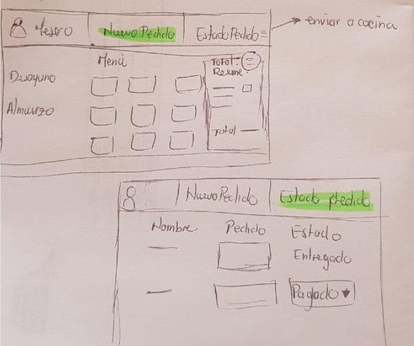
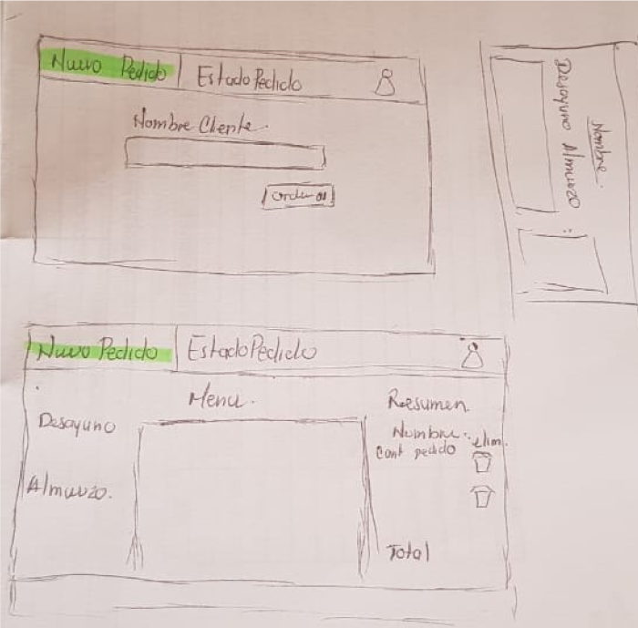
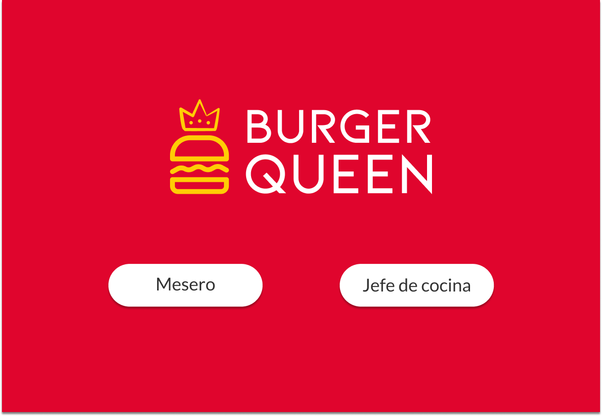
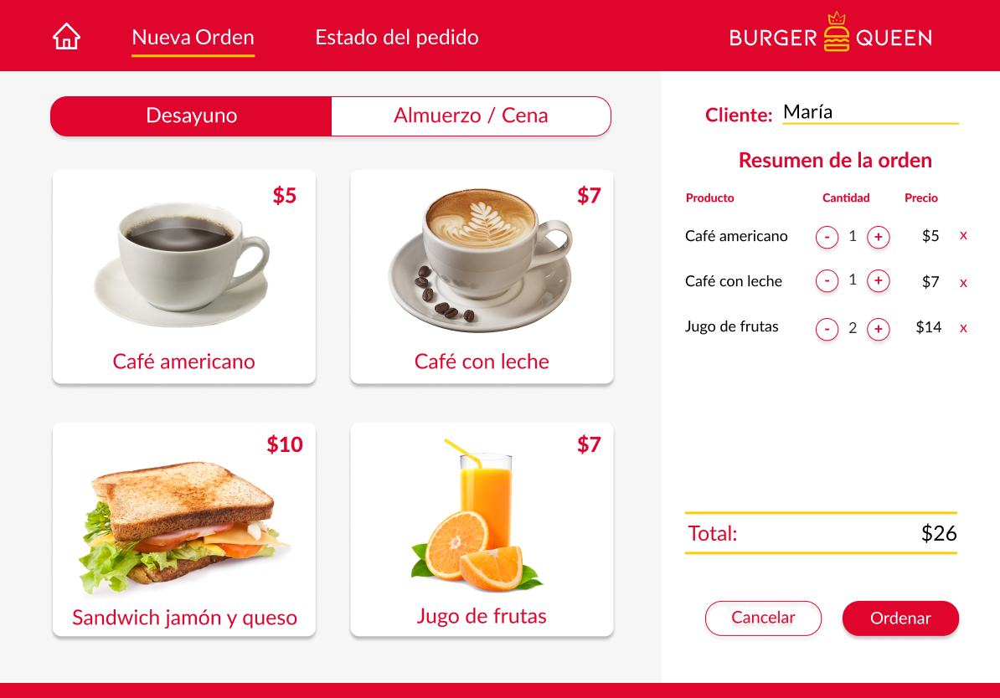
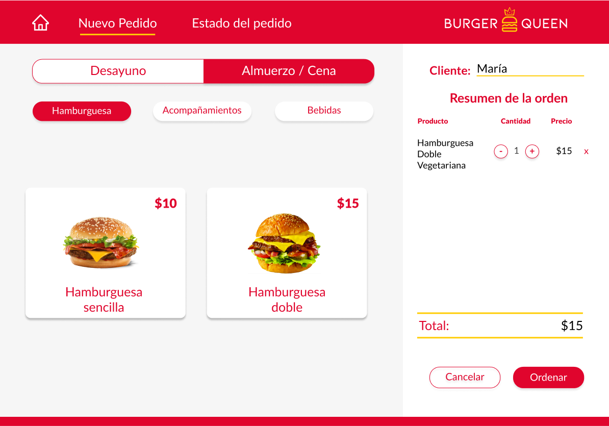
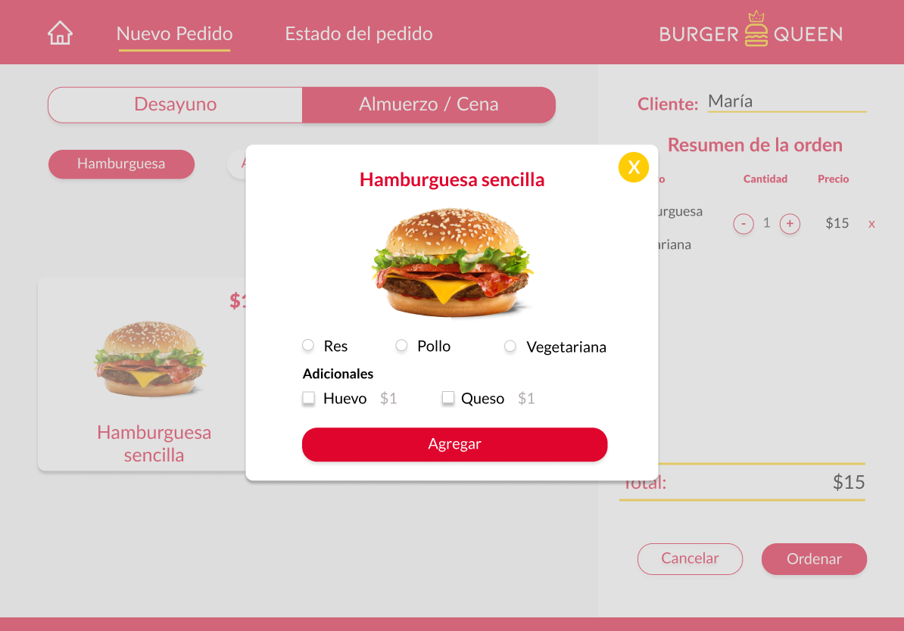
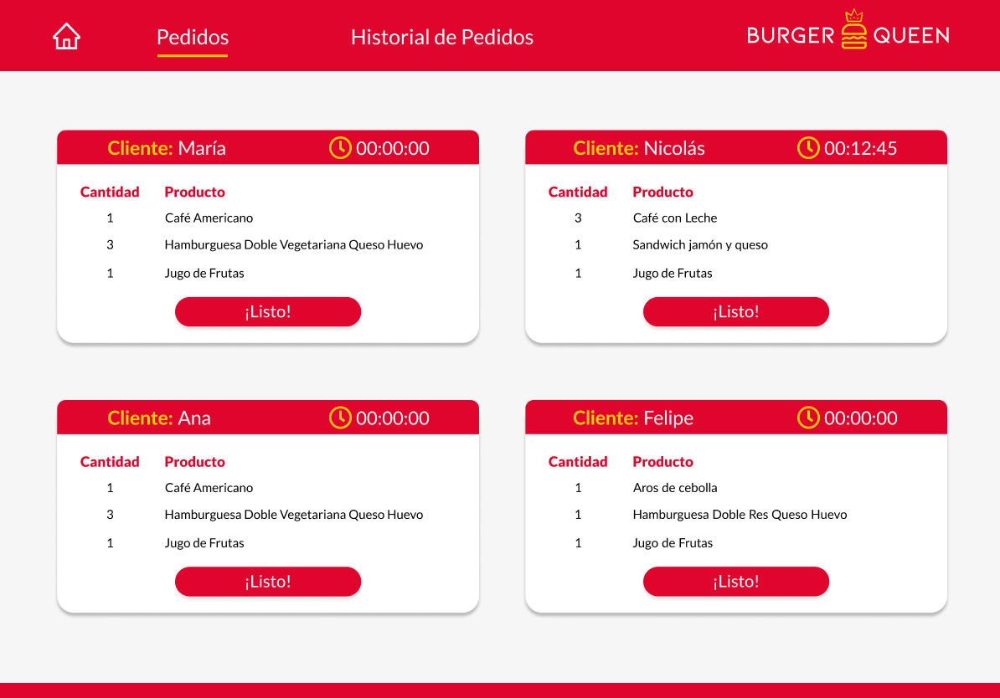
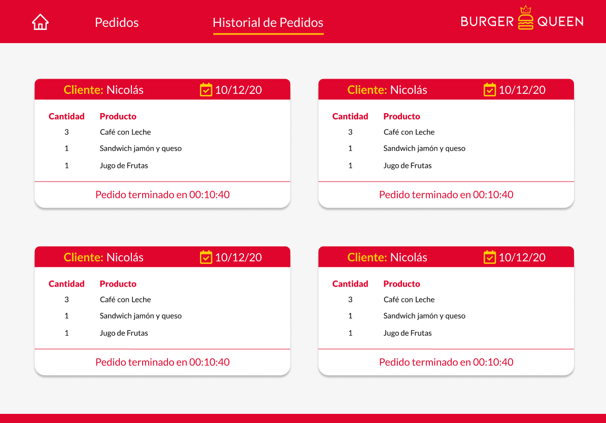

  

# Burger Queen

## Índice

* [1. Definición del producto](#1-definición-del-producto)
* [2. Historia de usuarios](#2-historia-de-usuarios)
* [3. Prototipos](#3-prototipos)
* [4. Solución final](#4-solución-final)
* [4. Objetivos de aprendizaje](#4-objetivos-de-aprendizaje)

## 1. Definición del producto

Creación de una interfaz que le facilite a los empleados del restaurante _Burger Queen_ poder tomar sus pedidos usando una _tablet_, y enviarlos a la cocina para que se preparen ordenada y eficientemente.

### Menú
>
> | Ítem                      |Precio $|
> |---------------------------|------|
> | Café americano            |    5 |
> | Café con leche            |    7 |
> | Sandwich de jamón y queso |   10 |
> | Jugo de frutas natural              |    7 |
>
> Y otro menú para el resto del día:
>
> | Ítem                      |Precio|
> |---------------------------|------|
> |**Hamburguesas**           |   **$**   |
> |Hamburguesa simple         |    10|
> |Hamburguesa doble          |    15|
> |**Acompañamientos**        |   **$**   |
> |Papas fritas               |     5|
> |Aros de cebolla            |     5|
> |**Para tomar**             |   **$**   |
> |Agua 500ml                 |     5|
> |Agua 750ml                 |     7|
> |Bebida/gaseosa 500ml       |     7|
> |Bebida/gaseosa 750ml       |     10|

La interfaz muestra dos menús (desayuno y resto del día), cada uno con todos sus _productos_. Los usuarios tienen la oportunidad de ir eligiendo qué _productos_ agregar y la interfaz va mostrando el _resumen del pedido_ con el costo total.

## 2. Historia de usuarios

#### HU1 Mesero/a debe poder tomar pedido de cliente

Yo como meserx quiero tomar el pedido de un cliente para no depender de mi mala
memoria, para saber cuánto cobrar, y enviarlo a la cocina para evitar errores y
que se puedan ir preparando en orden.

##### Criterios de aceptación

Lo que debe ocurrir para que se satisfagan las necesidades del usuario)

* Anotar nombre de cliente.
* Agregar productos al pedido.
* Eliminar productos.
* Ver resumen y el total de la compra.
* Enviar pedido a cocina (guardar en alguna base de datos).
* Se ve y funciona bien en una _tablet_

##### Definición de terminado

Lo acordado que debe ocurrir para decir que la historia está terminada.

* Debes haber recibido _code review_ de al menos una compañera.
* Haces _test_ unitarios y, además, has testeado tu producto manualmente.
* Hiciste _tests_ de usabilidad e incorporaste el _feedback_ del usuario.
* Desplegaste tu aplicación y has etiquetado tu versión (git tag).

***

#### HU2 Jefe de cocina debe ver los pedidos

Yo como jefx de cocina quiero ver los pedidos de los clientes en orden y
marcar cuáles están listos para saber qué se debe cocinar y avisar a lxs meserxs
que un pedido está listo para servirlo a un cliente.

##### Criterios de aceptación

* Ver los pedidos ordenados según se van haciendo.
* Marcar los pedidos que se han preparado y están listos para servirse.
* Ver el tiempo que tomó prepara el pedido desde que llegó hasta que se
  marcó como completado.

##### Definición de terminado

* Debes haber recibido _code review_ de al menos una compañera.
* Haces _test_ unitarios y, además, has testeado tu producto manualmente.
* Hiciste _tests_ de usabilidad e incorporaste el _feedback_ del usuario.
* Desplegaste tu aplicación y has etiquetado tu versión (git tag).

***

#### HU3 Meserx debe ver pedidos listos para servir

Yo como meserx quiero ver los pedidos que están preparados para entregarlos
rápidamente a los clientes que las hicieron.

##### Criterios de aceptación

* Ver listado de pedido listos para servir.
* Marcar pedidos que han sido entregados.

##### Definición de terminado

* Debes haber recibido _code review_ de al menos una compañera.
* Haces _test_ unitarios y, además, has testeado tu producto manualmente.
* Hiciste _tests_ de usabilidad e incorporaste el _feedback_ del usuario.
* Desplegaste tu aplicación y has etiquetado tu versión (git tag).
* Los datos se deben mantener íntegros, incluso después de que un pedido ha
  terminado. Todo esto para poder tener estadísticas en el futuro.

## 3. Prototipos

#### Protipo de baja

   

#### Protipo de alta

  
    

## 4. Solución final

  

## 5. Objetivos de aprendizaje

### HTML y CSS

* [x] [Uso de HTML semántico.](https://developer.mozilla.org/en-US/docs/Glossary/Semantics#Semantics_in_HTML)
* [x] Uso de selectores de CSS.
* [x] Construir tu aplicación respetando el diseño realizado (maquetación).
* [x] [Uso de flexbox en CSS.](https://css-tricks.com/snippets/css/a-guide-to-flexbox/)
* [ ] [Uso de Media Queries.](https://developer.mozilla.org/es/docs/CSS/Media_queries)

### JavaScript

* [x] Uso de condicionales (if-else | switch | operador ternario)
* [x] Uso de funciones (parámetros | argumentos | valor de retorno)
* [x] Manipular arrays (filter | map | sort | reduce)
* [x] Manipular objects (key | value)
* [x] Uso ES modules ([`import`](https://developer.mozilla.org/en-US/docs/Web/JavaScript/Reference/Statements/import)
| [`export`](https://developer.mozilla.org/en-US/docs/Web/JavaScript/Reference/Statements/export))
* [x] Diferenciar entre expression y statements.
* [x] Diferenciar entre tipos de datos atómicos y estructurados.
* [x] [Uso de callbacks.](https://developer.mozilla.org/es/docs/Glossary/Callback_function)
* [x] [Consumo de Promesas.](https://scotch.io/tutorials/javascript-promises-for-dummies#toc-consuming-promises)

### Testing

* [ ] [Testeo unitario.](https://jestjs.io/docs/es-ES/getting-started)

### Estructura del código y guía de estilo

* [x] Organizar y dividir el código en módulos (Modularización)
* [x] Uso de identificadores descriptivos (Nomenclatura | Semántica) // Pau y Ani sí, Aleja sigue usando Algo en todo.
* [x] Uso de linter (ESLINT) 💔

### Git y Github

* [x] Uso de comandos de git (add | commit | pull | status | push)
* [x] Manejo de repositorios de GitHub (clone | fork | gh-pages)
* [x] Colaboración en Github (branches | pull requests | |tags)
* [x] Organización en Github (projects | issues | labels | milestones)

### Firebase

* [x] [Firestore.](https://firebase.google.com/docs/firestore)
* [x] [Firebase security rules.](https://firebase.google.com/docs/rules)
* [x] Observadores. ([onSnapshot](https://firebase.google.com/docs/firestore/query-data/listen#listen_to_multiple_documents_in_a_collection))

### React

* [x] [`JSX`](https://es.reactjs.org/docs/introducing-jsx.html)
* [x] [Componentes `class` y componentes `function`](https://es.reactjs.org/docs/components-and-props.html#function-and-class-components)
* [x] `props`
* [x] [Eventos en React.](https://es.reactjs.org/docs/handling-events.html)
* [x] [Listas y keys.](https://es.reactjs.org/docs/lists-and-keys.html)
* [x] [Renderizado condicional.](https://es.reactjs.org/docs/conditional-rendering.html)
* [x] [Elevación de estados.](https://es.reactjs.org/docs/lifting-state-up.html)
* [x] [`hooks`](https://es.reactjs.org/docs/hooks-intro.html)
* [ ] [`CSS` modules.](https://create-react-app.dev/docs/adding-a-css-modules-stylesheet)
* [x] [React Router.](https://reacttraining.com/react-router/web)

### UX

* [x] Diseñar la aplicación pensando y entendiendo al usuario.
* [x] Crear prototipos para obtener feedback e iterar.
* [x] Aplicar los principios de diseño visual (contraste, alineación, jerarquía)
* [x] Planear y ejecutar tests de usabilidad.

### Otros recursos

#### Frameworks / libraries

* [React](https://es.reactjs.org/)
* [Vue](https://vuejs.org/)
* [Angular](https://angular.io/)

#### Herramientas

* [npm-scripts](https://docs.npmjs.com/misc/scripts)
* [Babel](https://babeljs.io/)
* [webpack](https://webpack.js.org/)

#### PWA

* [Tu primera Progressive Web App - Google developers](https://developers.google.com/web/fundamentals/codelabs/your-first-pwapp/?hl=es)
* [Progressive Web Apps - codigofacilito.com](https://codigofacilito.com/articulos/progressive-apps)
* [offlinefirst.org](http://offlinefirst.org/)
* [Usando Service Workers - MDN](https://developer.mozilla.org/es/docs/Web/API/Service_Worker_API/Using_Service_Workers)
* [Cómo habilitar datos sin conexión - Firebase Docs](https://firebase.google.com/docs/firestore/manage-data/enable-offline?hl=es-419)

#### Serverless

* [Qué es eso de serverless? - @PamRucinque en Medium](https://medium.com/@PamRucinque/qu%C3%A9-es-eso-de-serverless-f4f6c8949b87)
* [Qué es Serverless? | FooBar - YouTube](https://www.youtube.com/watch?v=_SYHUpLi-2U)
* [Firebase](https://firebase.google.com/)
* [Serverless Architectures - Martin Fowler](https://www.martinfowler.com/articles/serverless.html)

#### Cloud functions

* [Cloud functions - Firebase Docs](https://firebase.google.com/docs/functions/?hl=es-419)
